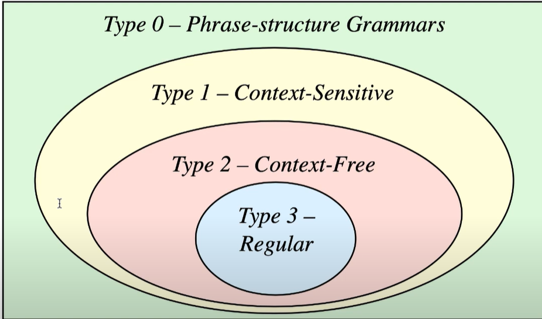

# Grammars
- a phrase structure grammar consists of 

1. non-empty set T of terminal symbols
2. non-empty set N of non-terminal symbols, this has a start symbol S annd is assumed to be disjoint from T
3. vocabulary V = T U N
4. a finite set P consisting of rewriting rules called production rules a -> b such that a, b in V* where V* is the set of all strings over V

we say that a grammar H has the data G = (N,T,P,S_ as the grammar is fully specified)
# Chomsky Hierarchy

  

# context-free grammars

# regular grammars

- type 3 if production is in one of three forms
    1. A -> aB -- produces a terminal symbol followed by a non-terminal symbol
    2. A -> a -- produces a terminal symbol
    3. A -> epsilon -- produces the empty string

a formal language is type 3 if it is generated by a type 3 / regular grammar

# type 2 / context free

    1. has to be in this form A -> w for some non-terminal symbol A and some string w in V*
    a formal language is type 2 if it is generated by a type 2 / context free grammar

# type 1 / context sensitive

    1. has to be in this form uAv -> uwv for some non-terminal symbol A and some strings u,v,w in V* where w is not the empty string
    a formal language is type 1 if it is generated by a type 1 / context sensitive grammar

- phrase - structure grammar is called a type 0 grammar, in other words, type 0 grammars do not underly any restrictions, a formal language is type 0 if it is generated by a type 0 grammar
- type 0 grammars are also called recursively enumerable grammars
- a formal language that doesnt have an empty string is called proper
# Ambiguity of grammars and ways of disambiguating an ambiguous grammar.

- lexical analyzier uses a regular grammar to recognize tokens

- the parser checks (using the context free grammar) if the prgoram is written in a correct syntatic structure according to the grammar, it will checj if a block statment is properly closed, if the number of brackets is correct, etc

