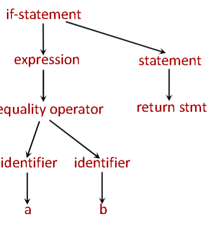
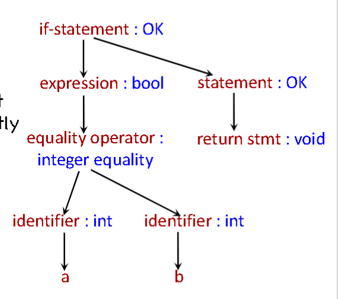
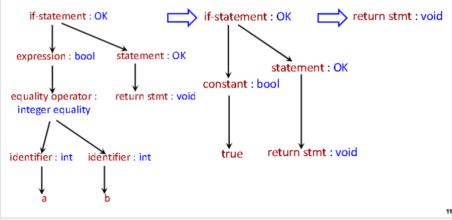

Syntax: Defines the set of valid programs
    - usually defined with the help of grammar and other conditions
Semantics: defines the meaning of programs

# each step of undoing abstraction 
1. Lexical analysis
    input: stream of characters 
        if (a == b) return;
    output: stream of tokens
        keyword[‘if‘]
        symbol[‘(‘]
        identifier[‘a‘]
        symbol[‘==‘]
        identifier[‘b‘]
        symbol[‘)‘]
        keyword[‘return‘]
        symbol[‘;‘]
2. parsing / syntactic analysis
    input: stream of tokens and characters
    output: parse tree
      

3. Type Checking
    input: parse tree
    output: parse tree with type information, to ensure that the types are used correctly

    if(a == b) return;

      
4. Optimization
transform the tree into an equivalent tree that is faster to execute
    input: parse tree with type infor
    output: parse tree with type info and optimized

      

5. Code Generation
    -  code gerenation is essentially undoing abstractions intil code is executable by some target machine
    -  control structures beceom jumps and conditional jumps
    -  variables become memory locations
    - variable become memory locations
    - variable names become addresses to memory locations
    - Abstract data types etc. disappear. What is left is
    data types directly supported by the machine such as
    integers, bytes, floating point numbers, etc.
    § Expressions become loads of memory locations to
    registers, register operations, and stores back to
    memory

# phases of compilation with theier erros

- Lexical analysis:
5abc
a === b
- Syntactic analysis:
if + then;
int f(int a];
- Type checking:
void f(); int a; a + f();
- Execution time:
int a[100]; a[101] = 5;
