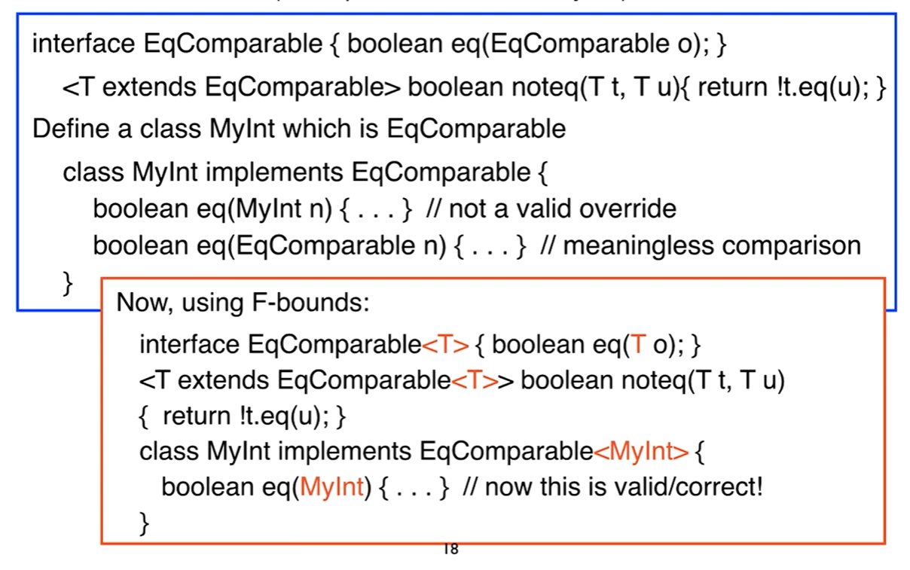

# Java Generics

## Motivation

Java generics are a powerful tool for writing type-safe code. They allow you to write code that is type-safe at compile time, but also allows you to use the same code with different types. This is a powerful tool for writing reusable code.

to have $\bold{type safe}$ polymorphism

Without generics

```java
List I = new LinkedList();
I.add(Integer.valueOf(7));
Integer x = (Integer) I.get(0); //needs this type cast
String s = (String) I.get(0); //bad cast exception but will compile
```

What happens without typecast?

there is a compiler error "Object cannot be cast to INTEGER"
since we did not specify the element type of the container, it assumes it is an object and an Integer type reference cannot be assigned to an object reference

With generics

```java
List<Integer> I = new LinkedList<Integer>();
I.add(Integer.valueOf(7));
Integer x = I.get(0); //no type cast needed
String x = I.get(0); //compiler error

```
compile time error occurs because the compiler knows that element is Integer and cant be assigned to a String

## Advantages of Generics

- Improved type safety

- Elimination of casts

- Parametric polymorphism

## Generic classes

```java

public class Pair<T,U>{ //T,U are type variables also called formal type parameters
    private T first;
    private U second;
    public Pair(T first, U second){
        this.first = first;
        this.second = second;
    }
    public T getFirst(){return first;}
    public U getSecond(){return second;}

}
Pair<Integer, String> p1 = new Pair<Integer, String>(1, "apple");
//Pair<Integer, String> is an invocation of the generic class
//decleration with the actual type parameters
Pair<Integer, String> p2 = new Pair<>(2, "pear"); //this works by type interence

```

placing empty <> after the class name is called type inference

if you dont put the <> the cmoplier will assume that you are trying to create a raw type, this will result in unchecked warnings, if you put the two values swapped it will give the same error but result in a compile time error later

Parametric polymorphism: generic classes are parametric polymorphic, meaning that they can be instantiated with different types

## Generic methods

```java

public class ArrayUtil{
    public static <E> void print(E[] inputArray){
        for(E element : inputArray){
            System.out.printf("%s", element);
        }
        System.out.println();
    }

}
//for each loop uses the iterator to itereate through the array
//usually you can omit type argument because it will infer

//explicit type argument is also allowed
ArrayUtil.<Integer>print(intArray);
//this is called a type argument
```
## type parameter constraints


Why does this following code work?
```java
public static<E> void Print(E[] inputArray){
    for(E element : inputArray){
        System.out.printf("%s", element); //invoke two string
    }
    System.out.println();
}
```

Java also needs constraints on the type parameters, without constraints only operations that are supported for all types can be used

if no constraints the constraints are Object

```java

public static <E extends Object> void print(E[] inputArray){
    for(E element : inputArray){
        System.out.printf("%s", element);
    }
    System.out.println();
}
```
E extends object justifies the toString
need to override toString method when making a class

## examples of consraints

```java
//erroneous
public static <E> void print(List<E> a, E threshold){
    for(E element : a){
        if(element.compareTo(threshold) < 0) //type error
            System.out.println(element.toString());
        system.out.println();
    }
    
}
//in order to use compareTo, E must be a Comparable
public static <E extends Comparable<E>> void print(List<E> a, E threshold){
    for(E element : a){
        if(element.compareTo(threshold) < 0) //no longer type error
            System.out.println(element.toString());
        system.out.println();
    }
    
}

```
comparable interface itself is also paramterized

## Type Parameter with Multiple Bounds

Multiple bounds for a single type paramter allowed:

```java
public static <T extends B1 & B2 & B3> void method(T t){...}
```
extends is used in a general sense to mean either "extends" as in classes or "implements" as in interfaces

if one of the bounds is a class it must be specified first

# F-bounded quantification

allows the type parameter being constrained to appear in its own bounds

```java
public static <E extends Comparable<E>> void print(List<E> a, E threshold){
    for(E element : a){
        if(element.compareTo(threshold) < 0) //no longer type error
            System.out.println(element.toString());
        system.out.println();
    }
    
}
```
this allows more consice typing of methods

E is constrained by Comparable<E> 

# plain bounded quantification

```java
class Point
{
    public int x,y;
    public static Point move(Point p, int dx, int dy){
        p.x += dx;
        p.y += dy;
        return p;
    }
}
class ColorPoint extends Point{
    public int color;
    
}
```
colorpoint is a subtype of point, but substituting a colorpoint for a point is not type safe

```java
Point p = new Point();
p.x = 0;
p.y = 0;
Point t = Point.move(p, 1, 2);
//this is no problem

//if you try to move a colorpoint
ColorPoint cp = new ColorPoint();
cp.x = 0;
cp.y = 0;
cp.color = 0;
cp = Point.move(cp, 1, 2); //type error, with just subtyping the exact type of cp is lost when passed to and returned from move()
p = Point.move(cp, 1, 2); //ok

```
when you assigned the return point object to a colorpoint object, the colorpoint object was lost, assigning to a point is fine

## Parametric Polymorphism

a fix to losing type accuracy is to use parametric polymorphism(instead of subtyping)

```java
public static <T> T move(T p, int dx, int dy){
    p.x += dx;
    p.y += dy;
    return p;
}// access to members x and y and operations on them must be justified by some type constraint
public static <T extends Point> T move(T p, int dx, int dy){
    p.x += dx;
    p.y += dy;
    return p;
}
//simple constraint: T itself does not appear in the constraint, constraint is fixed for all instantiations
```
## problems with bounded quantification

Task: define a method translate that takes ant movable object and returns an object of the same type, but moves one unit aong both axes. 
First attempt (does not work):
```java

<T extends Movable> T translate (T m){return m.move(1,1);}
//type error, move is (essnetially) of type: Movable(int,int) -> Movable
//so the problem of subtyping loss of type accuracy is still there

```
## Binary method problem

assume the following interface
```java
interface EqComparable{boolean eq(EqComparable other);}
```

Task: define a method noteq to compute the negation of eq

this is what plain bounded quantification would look like
```java
<T extends EqComparable> boolean noteq(T x, T y){return !x.eq(y);}
//now define class MyInt which is EqComparable
class MyInt implements EqComparable{
    boolean eq(MyInt n){...} //not a valid override
    boolean eq(EqComparable other){...} //meaningless comparison allow anything implementing equal comparable to be compared to myint
}
```
F bounded quantification allows the type parameter being constrained to appear in its own bounds

```java
<T extends A<T>>
//T is the type paramter being bounded by A<T>

//the unsucesful translate:

interface Movable{Movable move(int dx, int dy);}

<T extends Movable> T translate(T m){return m.move(1,1);}

//can now be written as

interface Movable<T> {T move(int dx, int dy);}
<T extends Movable<T>> T translate(T m){return m.move(1,1);}

//allows type paramter to appeat in bounds itself
```

  
