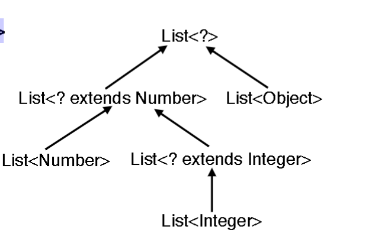

# Unamed type parameters: Wild cards

```java
// parameter type List<Object> would cause a compile error
// when trying to pass ArrayList<String> for example
static void printAll (List<?> l) { // this works
for (Object o : l) System.out.println(o);
}
```
- even though String and vehicle are not related, they are both subtypes of Object list of string is not a subtype if list object thus the compiler will not allow it

- the parameter type List<?> is a wildcard type
    - print method can be called with any type of list that is a subtype of list of object
    - the wildcard type List<?> is a subtype of List<Object>

## wild cards bound from above

``` java
// ? reads “unknown”, corresponds to a fresh type variable
// Number is the upper bound of the wildcard
static double sum(List<? extends Number> list) {
double sum = 0.0;
for (Number n : list) sum += n.doubleValue();
return sum;
}
List<Integer> li = new ArrayList<Integer>();
li.add(8);
li.add(42);
li.add(15);
double sum = sum(li); // works
```

-the list will accept any type that is a subtype of Number
- the wildcard is upperbounded by Number

## wild cards bound from below

```java
//Contravariance expressed with wildcards:
<T> void copy(List<T> source, List<? super T> dest)
{ . . . dest.add(source.get(i)) . . . }
List<Object> lo;
List<Integer> li;
copy(li, lo); // ok
copy(lo, li); // not ok
//Two alternative formulations of copy:
<T> void copy(List<? extends T> source, List<T> dest);
<T, S extends T> void copy(List<S> source, List<T> dest);
//The “fresh type variable” model describes wildcards to some extent,
//but does not apply in all contexts.
```

- copies values from source list to dest, the type of the dest list is a subtype of the type of the source list
- super lower bounds the wildcard type
- if you pass list of interger for source and list of object for dest, the compiler will not allow it

## typing and subtyping with wildcards

-the type paramters involving wildcards can form subtype relations as well

```java
For any T, List<T> <: List<?>
```
  

Since element type is not known of an object of type List<?>,
no objects can be written to it (nulls can)
but Objects can be read from it

wild card is upperbounded by object by default

## wild cards in Variable types

- Wildcards are allowed in other contexts than in just method
parameter types: types of local variables, fields, arrays
Example:

``` java
List<?> aList = new LinkedList<String>(); //list of unknown type refers to a list of string

aList.add(“Hi”); // compile error, with the message below:

method List.add(CAP#1) is not applicable
(argument mismatch; String cannot be converted to CAP#1)
method List.add(int,CAP#1) is not applicable
(actual and formal argument lists differ in length)
where CAP#1 is a fresh type-variable:
CAP#1 extends Object from capture of ?
```


-However “wildcard capture” allows use of wildcard objects in some situations:
can be captures using type parameter as loin as the type parameter is carried internally
- you can only do things where a wildcard type is expected


``` java
public static <T> List<T> foo(List<T> list) {
printAll(list); // works ok
// list.add(“Here!”); // compile error: String cannot be converted to T
return list;
}
...
List<String> ls = new LinkedList<String>();
List<?> aList = ls;
List<?> ell = foo(aList); // ok
When aList of type List<?> is passed to foo, the capture of the wildcard is
represented as some unknown generic type X, and as foo’s type parameter is
List<T> for any T, the inferred type of T is X (this conversion of the capture of the
wildcard to the type T is called “capture conversion”).
The capturing is not visible outside of the method where it occurs
List<String> bList= foo(aList); // error
```

## type erasure

1. Backwards compatibility was a hard constraint for design
2. Generic Java programs are compiled to class files that
run on unchanged JVM.
3. Generic types are used during type checking, then
erased according to a set of translation rules:
a. A type parameter is replaced with its first bound 
b. Parametrized types throw away the parameters
c. Casts are inserted where necessary
[Note: Compared to time prior generics, run-time casts
still prevail (no improvement on performance) but they’ll
never throw an exception.]
17

- in Java for each generic type there is only one class that is the compiler erase all generic type information from the compiles class
- erasure for generic type is the raw type: erasure for List<String> is List
- 
## erasure example

```java
//Generic code
class A<T> { abstract T id(T x); }
class B extends A<Integer> { Integer id(Integer x) { return x; } }
//Translated code
A<T> -> A
T -> Object (T had no bound, thus the bound is Object)
//Create a bridge method to fix type incompatibilities created in
//the translation.
class A { abstract Object id(Object x); }
class B extends A {
Integer id(Integer x) { return x; }
Object id(Object x) { return id((Integer)x); } // bridge
} 
```
- the erasure is raw type A withou the type parameter
- every occurence of T is replaced with Object
- since B is a subtype of A<Integer> the compiler will insert a bridge method to fix the type incompatibility

## implications of erasure

- array list of Integer and String have the same class type

-Only one run-time representation for all instances of a generic class:
``` java
List<String> l1 = new ArrayList<String>();
List<Integer> l2 = new ArrayList<Integer>();
System.out.println(l1.getClass() == l2.getClass()); // true
///Some natural code is unnaturally rejected:
class Foo<T> {
public void bar(T x) {
T t = new T(); // error
if(x instanceof T) {} // error
}
public static void static_bar(T t) {} // error
public static List<T> l; // error
}
```
Last two: no type parameters allowed in static context.


boolean, int, etc. not allowed as type arguments for the
type parameters.
Fix: Autoboxing, auto-unboxing of primitive types:
``` java
ArrayList<Integer> list = new ArrayList<Integer>();
// used to be like this
list.add(0, new Integer(42));
int total = (list.get(0)).intValue();
// thanks to auto(un)boxing, one can say
list.add(0, 42);
total = list.get(0);
```
## Still affects performance.

Type Erasure Summary
- Type erasure was chosen for it so that no
changes are required to the instruction set of
the JVM.
- Desire to retain backward compatibility affected
design decisions in Java libraries as well.
- Some confusing issues - sometimes
compromises are necessary in practical
language design.
- Aside: C# generics very similar, but C# does
not fully erase type information


